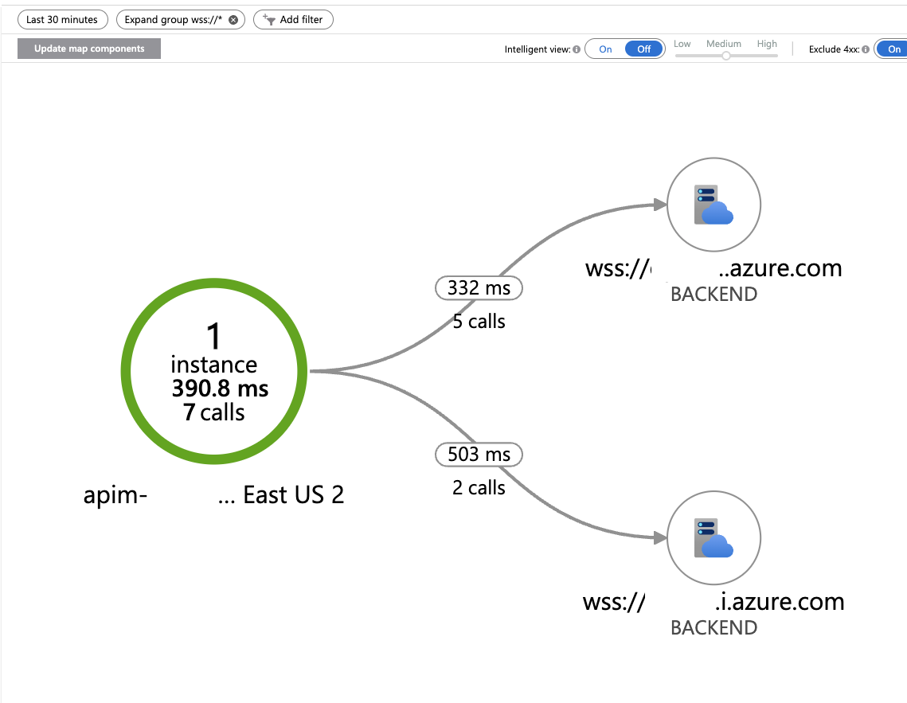

# Load Balancing for Azure OpenAI Realtime API Calls

## Implementation Details

This sample demonstrates how APIM can be used to load balance across different Azure OpenAI models and endpoints. The implementation is based on top of the [AI Hub Gateway Solution Accelerator](https://github.com/Azure-Samples/ai-hub-gateway-solution-accelerator), which includes configuration for the Azure OpenAI Realtime API.

The load balancing policy in this repository (`aoai-realtime-lb.xml`) distributes incoming WebSocket connections across multiple Azure OpenAI endpoints to achieve greater total throughput.

## How It Works

The policy uses a hashing algorithm based on the request ID to deterministically route new connections to one of the available backends:

1. Each incoming request is assigned a hash value based on the request ID
2. The request is directed to one of the available Azure OpenAI endpoints based on this hash
3. Backend-specific configuration (endpoint URI and API key) is applied
4. The connection is established to the selected backend

## Considerations

- Client-side load balancing is an alternative approach that may be suitable for some scenarios
